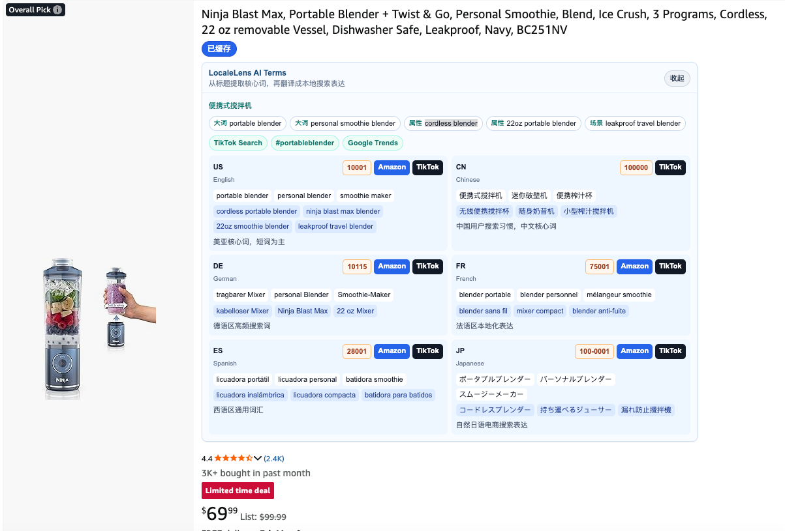
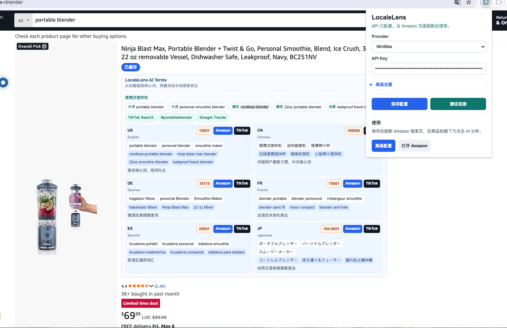
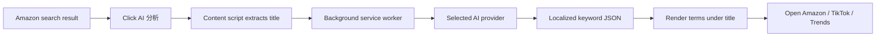

<div align="center">


# LocaleLens

**面向跨境选品和市场调研的 AI 关键词本地化 Chrome 插件**

*Turn Amazon product titles into localized market keywords for Amazon and TikTok research.*

<br />


</div>

---

> LocaleLens 的目标很直接：当你在 Amazon 上做选品、看竞品、找灵感时，不用把标题复制到翻译工具和关键词工具里来回切换。点一下商品标题下方的 `AI 分析`，插件会把标题拆成核心词、长尾词、属性词和场景词，并翻译成本地买家更可能搜索的表达。

## 项目介绍

LocaleLens 是一个原生 Chrome Manifest V3 扩展。它会在 Amazon 搜索结果页的商品标题下方注入一个轻量按钮，用户主动点击后才调用 AI 模型分析当前商品标题。

它适合这些场景：

- 在美国站点调研后，把产品灵感快速扩展到德国、法国、西班牙、日本等市场。
- 从英文标题中提取真正有价值的产品大词、属性词和长尾词。
- 把中文思路和英文标题转成当地消费者更自然的搜索表达。
- 一键打开目标 Amazon 市场或 TikTok 搜索，继续验证需求、内容热度和标签方向。

## 核心能力

<table>
<tr>
<td width="50%" valign="top">

### Amazon 页面注入

- 在 Amazon 搜索结果页商品标题下方显示 `AI 分析`
- 只在用户点击后调用模型，避免整页批量分析导致 token 消耗过高
- 同一时间只处理一个商品，减少页面卡顿和 API 堵塞
- 分析结果直接显示在商品标题下方，可收起和展开

</td>
<td width="50%" valign="top">

### 关键词本地化

- 从标题提取核心大词、长尾词、属性词、使用场景词
- 生成 US、CN、DE、FR、ES、JP 等市场的本地搜索表达
- 避免逐字翻译，更偏向当地买家会搜的自然短语
- 每个关键词都可以直接点击复制，方便贴到 Amazon、TikTok 或第三方工具中继续验证
- 支持中文备注，方便判断词语为什么适合这个市场

</td>
</tr>
<tr>
<td width="50%" valign="top">

### 市场跳转

- 一键打开目标 Amazon 站点搜索结果
- 支持 TikTok Search、TikTok hashtag、Google Trends 探索入口
- 为不同 Amazon 市场准备默认邮编，打开目标站点时可快速复制
- 适合从关键词调研继续走向内容验证和市场验证

</td>
<td width="50%" valign="top">

### 多模型配置

- 点击插件图标即可配置 Provider 和 API Key
- 普通模式只保留必要输入，高级设置可自定义 Endpoint、Model、API Style
- 支持测试连接，先验证 API Key 和模型接口是否可用
- 每个 Provider 独立保存 API Key、Endpoint、Model 和接口风格

</td>
</tr>
</table>

## 产品截图

<table>
<tr>
<td align="center" width="50%">
<strong>Amazon 标题下方分析模块</strong><br /><br />

</td>
<td align="center" width="50%">
<strong>插件弹窗配置</strong><br /><br />

</td>
</tr>
</table>

## 页面效果

在 Amazon 搜索结果页中，LocaleLens 会把分析模块放在商品标题下方：

```text
Ninja Blast Max, Portable Blender + Twist & Go...
[AI 分析]

LocaleLens AI Terms
从标题提取核心词，再翻译成本地搜索表达

大词 portable blender
长尾 personal smoothie blender
属性 cordless blender
场景 leakproof travel blender

US    portable blender / personal blender / smoothie maker
DE    tragbarer Mixer / personal Blender / Smoothie-Maker
FR    blender portable / blender personnel / melangeur smoothie
ES    licuadora portatil / licuadora personal / batidora smoothie
JP    ポータブルブレンダー / パーソナルブレンダー
```

## 支持的模型入口

LocaleLens 目前内置以下 Provider 预设：

`MiniMax` `OpenAI` `OpenRouter` `DeepSeek` `Qwen / DashScope` `Groq` `Google Gemini` `Anthropic / Claude` `SiliconFlow` `Custom`

默认配置优先使用 MiniMax 的 Anthropic-compatible 接口：

```text
Endpoint: https://api.minimaxi.com/anthropic/v1/messages
Model: MiniMax-M2.7
API Style: anthropic-bearer
```

如果你的服务商兼容 OpenAI `chat/completions`，也可以选择 `Custom` 并填入自己的 Endpoint 和 Model。

为了保持配置简单，MiniMax 默认只展示一个入口。旧版 OpenAI-compatible MiniMax 接口仍保留底层兼容，但普通用户不需要在 Provider 下拉框里区分它。

## 使用方法

1. 打开 Chrome 的 `chrome://extensions`。
2. 开启右上角 `Developer mode`。
3. 点击 `Load unpacked`。
4. 选择本项目目录。
5. 点击浏览器工具栏里的 LocaleLens 图标。
6. 选择模型服务商，填写 API Key，点击 `保存配置`。
7. 点击 `测试连接`，确认模型接口可用。
8. 打开 Amazon 搜索页，刷新页面。
9. 在商品标题下方点击 `AI 分析`。

## 为什么不是自动分析整页

Amazon 搜索页通常会一次展示很多商品。如果进入页面后自动分析所有标题，会带来三个问题：

- token 消耗不可控。
- 多个 API 请求同时发出，页面容易变慢或堵塞。
- 很多商品并不是当前真正感兴趣的对象。

所以 LocaleLens 采用手动触发方式：看到有灵感的商品时，再点标题下方的按钮分析。

## 数据流



LocaleLens 不使用自有服务器。扩展只会在用户主动点击 `AI 分析` 时，把当前商品标题、页面市场和搜索词发送到用户配置的第三方 AI 服务商。

API Key 保存在 Chrome 扩展存储中，用于向对应服务商发起请求。请不要把包含真实 API Key 的配置截图、导出文件或浏览器资料公开分享。

## 本地开发

这是一个无构建步骤的原生 Chrome 扩展。修改代码后，在 `chrome://extensions` 中点击插件卡片上的刷新按钮即可重新加载。

常用语法检查：

```bash
node --check src/background.js
node --check src/content.js
node --check popup/popup.js
node --check options/options.js
node -e "JSON.parse(require('fs').readFileSync('manifest.json','utf8')); console.log('manifest ok')"
```

## 项目结构

```text
.
├── manifest.json
├── assets/
│   ├── icon.svg
│   ├── icon-16.png
│   ├── icon-32.png
│   ├── icon-48.png
│   └── icon-128.png
├── docs/
│   ├── locale-lens-amazon.png
│   └── locale-lens-popup.png
├── src/
│   ├── provider-presets.js
│   ├── background.js
│   ├── content.js
│   └── styles.css
├── popup/
│   ├── popup.html
│   ├── popup.js
│   └── popup.css
└── options/
    ├── options.html
    ├── options.js
    └── options.css
```

## 后续方向

- 接入 Sorftime、卖家精灵等第三方市场数据源。
- 针对 TikTok Shop、TikTok Creative Center 和 hashtag 页面做更深的标签分析。
- 增加关键词收藏、导出和按产品想法分组。
- 加入不同市场的搜索量、竞争度、趋势和内容热度评分。
- 支持更多 Amazon 市场和更多小语种表达。

## 发布打包

发布前建议只保留扩展运行必需文件，并确认没有包含真实 API Key、临时文件、测试截图或本地缓存。

建议打包内容：

```text
manifest.json
assets/
src/
popup/
options/
README.md
```
